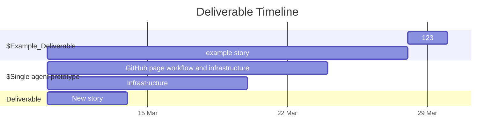

# Timeline

Auto-generated from story frontmatter (`start_date`, `deadline`, `status`).

```mermaid
gantt
    title Deliverable Timeline
    dateFormat YYYY-MM-DD
    axisFormat %d %b
    tickInterval 1week

    section $Example_Deliverable
    123 : 123, after example_story, 2d
    example story : example_story, 2026-03-10, 18d

    section $Single agent prototype
    GitHub page workflow and infrastructure : github_page_workflow_and_infrastructure, 2026-03-10, 14d
    Infrastructure : infrastructure, 2026-03-10, 10d

    section Deliverable
    New story : new_story, 2026-03-10, 4d
```

### Dependencies

- ⛔ **example story** → blocks → **123**

Updated: 2026-03-10 15:08